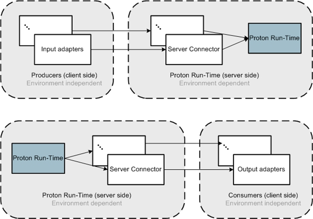
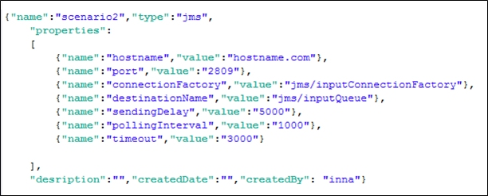

# IBM Proactive Technology Online (Proton) Programmer Guide
IBM Research – Haifa

Licensed Materials – Property of IBM

©Copyright IBM Corp. 2012, 2013, 2014, 2015, 2016  All Rights Reserved.

Version 5.4.1: July 2016 (no Changes from 4.4.1 of May 2015)

###Table of Contents

[Proton architectural principles](#archprins)	 
[Proton conceptual architecture](#conceptarch)	 
[High-level architecture](#higharch)	 
[Proton adapters](#adapters)	 
[Overview](#overview)	 
[Adapter design principles](#designprins)	 
[Adapter design](#adapdesign)	 
[Input adapters](#inadapters)	 
[Runtime](#iruntime)	 
[Definition](#idef)	 
[Interfaces to implement](#iinterfaces)	 
[Output adapters](#outadapters)	 
[Runtime](#oruntime)	 
[Definition](#odef)	 
[Interfaces to implement](#ointerfaces)	 
[Configuration](#config)	 
[Metadata](#metadata)	 

 
##Proton Architectural Principles

###Proton Conceptual Architecture

The principles behind Proton architecture ensure scalable, fault-tolerant, parallel architecture, while ensuring execution according to correctness schemes. 

In parallel architecture we address the following issues: 

- Partitioning of event load (processing multiple event instances simultaneously)
- Partitioning of logic (processing the same event instance simultaneously by different agents)

The challenge is that we need both sharding (data partitioning between different system instances to handle multiple independent operations simultaneously) and logic partitioning.  We need to allow partitioning of event load and distribution of logic while taking into account that both the logic and event instances are co-dependent.

The architecture also ensures separation of logic and environment-specific services, to allow single Proton logic core that will be able to run in different environments.

###High-level Architecture 

 
*Figure 1: High-level architecture*

The incoming events are handled by multiple routing threads that route the events to the relevant agent queues - according to the agent type and/or context type that an event is intended for. After the buffering time (either minimal or correctness-based) of the agent queue expires, the event is handled by processing threads, sent to partitioning by context service, and sent to the EPA (Event Processing Agent) manager for processing by particular agent instance according to agent type and context partition.

This allows for: 1) handling of the same event instances simultaneously by different agents 2) handling multiple incoming instances in parallel but 3) saving order (either detection or occurrence) between dependent event instances. 

Since we handle all relevant events for the same context partition in the same node, we have data locality. 

Derived events are driven back to the system in case they also act as input events to additional agents within the EPN (Event Processing Network), and/or to output adapters for derived events intended for the consumer.
	
##Proton Adapters

###Overview

 
*Figure 2: Adapters and Proton runtime* 

The Proton semantic layer allows the user to define producers and consumers for event data (see figure above). Producers produce event data, and consumers consume the event data. The definitions of producer and consumer, which are specified during the application build-time, are translated into input and output adapters in Proton execution time. 

The physical entities representing the logical entities of producers and consumers in Proton are adapter instances.

The adapters are environment-agnostic.  The adapters use the environment-specific connectivity layer to connect to environment-specific Proton implementation.

 
*Figure 3: Adapters layer representation* 

As shown in Figure 3, an input adapter for each producer defines how to pull the data from the source resource, and how to format the data into a Proton object format before delivering it to the engine. The adapter is environment-agnostic, but uses the environment-specific connector object, injected into the adapter during its creation, to connect to Proton runtime. 

The consumers and their respective output adapters are operated in a push mode. Each time an event is published by the runtime it is pushed through environment-specific server connectors to the appropriate consumers, represented by their output adapters, which publish the event in the appropriate format to the designated resource.

The server connectors are environment-specific. They hide the implementation of the connectivity layer from the adapters, which allows them to be environment-agnostic.

The J2SE implementation of Proton runtime includes input and output socket servers, which allow the input and output server connectors to communicate with the runtime using sockets mechanism.

###Adapter Design Principles

As part of the Proton application design, the user specifies the event producers as sources of event data, and the event consumers as sinks for event data.
 
The specification of producer includes the resource from which the adapter pulls the information (whether this resource is a database, a file in a file system, a JMS queue, or REST), and format settings, which allow the adapter to transform the resource specific information to a Proton event data object. The formatting depends on the kind of resource we are dealing with – for file it can be a tagged file formatter, for JMS an object transformer. 

For example, in a tag format, when the user defines the delimiter as ";" and the tagDataSeparator as "=", an event of type ShipPosition with attributes ShipId, Long, lat, and Speed are expected to arrive in the following format:
Name=ShipPosition;ShipID=RTX33;Long=46;Lat=55;Speed=4.0;

The specification of consumer also includes the resource in which the event created by Proton runtime should be published, and a formatter that describes how to transform a Proton event data object into a resource-specific object.

The adapter layer design satisfies the following principles: 

- A producer is a logical entity that holds such specifications as the source of the event data, and the format of the event data. The input adapter is the physical entity representing a producer, an entity which actually interacts with the resource and communicates event information to the Proton runtime server.
- A consumer is a logical entity that holds such specifications as the sink for the event data, and the format of the sink event data. The output adapter is the physical representation of the consumer. It is invoked by the Proton runtime when an event instance should be published to the resource.
- The input adapters all implement a standard interface, which is extendable for custom input adapter types and allows adding new producers for custom-type resources.
- The output adapters all implement a standard interface, which is extendable for custom output adapter types and enables adding new consumers for custom-type resources.
- A single event instance can have multiple consumers.
- A producer can produce events of different types.  A single event instance might serve as input to multiple logical agents within the event processing network, according to the network's specifications.
- Producers operate in pull mode. Each input adapter pulls the information from a designated resource according to its specifications. It processes the incremental additions in the resource each time.
- Consumers define a list of event types that they are interested in. They can also specify a filter condition on each event type. Only event instances that satisfy this condition will be delivered to this consumer.
- Consumers operate in push mode. Each time the Proton runtime publishes an event instance it is pushed to the relevant consumer.
- The producers and consumers are not directly connected, but the raw event data supplied by a certain producer can be delivered to a consumer if the consumer specifies this event type in its desirable events list.

###Adapter Design

A user defines a producer or consumer to act as event data supplier or consumer by using Proton's build-time tool to create the appropriate metadata. The metadata defines the access information to the event data source or sink, and the information on how to format the data to/from the Proton readable event object. 

The adapter framework is built on the notion of extending a common abstract adapter (one for all input adapters and one for all output adapters). The adapter framework provides the entire sequence of the adapter's lifecycle management (initialization, establishing connection to the server, processing of data, and shutdown). Each specific adapter implementation  has to supply resource-specific implementations of readData() or writeObject() methods, to pull the data from this resource or push the data to the resource (see Figure 4 for class diagram of the framework), as well as createConfiguration() adapter-specific method, which fetches the required adapter-specific properties from producer/consumer metadata and creates the appropriate configuration object.

 
*Figure 4: Adapters framework class diagram*  

###Input Adapters

####Runtime

The adapter that represents the producer is configured, and upon startup it is supplied with a server connector that handles all communication of the adapter with Proton runtime (see Figure 5 for initialization sequence diagram).

 
*Figure 5: Adapter initialization sequence - establishing connection to Proton server*  

Once the adapter starts running (see Figure 6 for processing sequence), it constantly polls the data source for changes (1,2), transforms an entry within the data source into a Proton readable event object (3), and sends the information via server connector to the server (4), without being aware of the underlying communication infrastructure that the connector uses to establish the connection and send the data to the server.

 
*Figure 6: Input adapter processing sequence*  

####Definition

To define a producer, we use the build-time tool to choose the producer type and to define suitable properties. Figure 7 depicts a producer definition screen in the Proton authoring tool. 

 
*Figure 7: Input adapter processing sequence*  

To define a producer, we need to supply the following information: 

- The general metadata including the name of the producer, the description, the createdDate and createdBy information.
- The type of the producer – currently supports FILE, JMS adapters, planned support for REST, DB, and custom adapters. Note: JMS adapter is not supported in the open source version.
- A list of properties per specific chosen type that specifies which resource to access, the credentials to access the resource, and the formatter information.
      - **File adapter:** (see Figure 8). The relevant properties include:
        - The absolute path to the file representing the resource this file adapter is polling.
        - Sending delay between sending  available event instances to the system.
        - Polling interval – the interval between two consecutive polls of the resource for updates.
        - Formatter type for the entries within the file: currently supports the tag-delimited formatter.
        - Properties of the tag-delimited formatter, including the delimiter ,and the tag-data separator characters. 
 
*Figure 8: Producer of file type JSON definition*

      - **JMS adapter** (see Figure 9):  
Note: JMS adapter is not supported in the open source version.
The relevant properties include:
        - The hostname of the server where the input JMS destination resides.
        - The port to connect to on the server where the input JMS destination  resides.
        - The JNDI name of the connection factory object.
        - The JNDI name of the destination object.
        - Timeout – the timeout to wait for a new object on the JMS destination.
        - Sending delay between sending available event instances to the system.
        - Polling interval – the interval for two consecutive polls of the resource for updates.

 
*Figure 9: Producer of type JMS object message JSON definition*

If those are the only properties mentioned, then the JMS producer assumes that the JMS destination contains serializable objects, which implement the **IObjectMessage** interface (see in the description of interfaces).

We can specify additional options for the formatter, in which case the JMS adapter implementation assumes the JMS message is a tag-delimited text message with the specified formatting information.

Additional properties for a JMS producer that wishes to use formatted text messages are (see Figure 10):

- Formatter – the formatter type (currently only tag-delimited messages are supported so the only option is 'tag').
- Delimiter – the delimiter string between the tag-data groups.
- TagDataSeparator – the separator within the tag-data pair.

 
*Figure 10: Producer of type JMS formatted text message JSON definition*

The JMS producer supports the WebSphere 7.x api. To use the WebSphere api for JMS, WebShpere, thin client libraries need to be added to the Proton lib directory.

- REST adapter (see Figure 11), is a REST service provider that receives events from an external system (the producer) using the POST method.  The relevant properties of this adapter include:
      - contentType - can be "text/plain", "text/xml", "application/xml", "application/json" etc. This defines the content that the service accepts and what formatter to apply.
      - Formatter properties - the same as in file. The user has to supply correct formatters to work with the defined content type. For example, adding formatters to deal with XML or JSON content. If the user defines a formatter not suitable for contentType (for example, defines tag formatter for a content which is not plain text) the user will get an exception.

 
*Figure 11: Producer of type REST definition*

####Interfaces to Implement

An input adapter needs to implement a few interfaces: 

1. It should extend the AbstractInputAdapter abstract class, which in turn implements the IInputAdapter interface. The  developer should provide implementation for the following methods: 
      - IInputAdapterConfiguration createConfiguration(ProducerMetadata metadata)  - creates the adapter-specific configuration object after extracting the relevant properties from the producer metadata object.
      - void initializeAdapter()  - a method that exists in the abstract interface, but should be overloaded with any resource-specific initialization after the call to the parent method (such as acquiring a handle to a file, opening a connection to data source, etc.).
      - IEventInstance readData() –accesses the resource, pulls the event data, and transforms each event data entry into a Proton event instance object.
      - void shutdownAdapter() – a method that exists in the abstract interface, but should be overloaded with any resource-specific shutdown actions after the call to the parent method (such as closing a handle to a file, closing a connection to data source, etc.).
2. It should provide an adapter- specific implementation of an IInputAdapterConfiguration interface for an adapter-specific configuration object. This is basically a bean with getters method carrying adapter-specific information that helps the adapter to access the specific resource (such as filename for file adapter, or hostname and port name for JMS server for the JMS adapter).

###Output Adapters

####Runtime

The adapter that represents the consumer is configured, upon startup it is supplied with a server connector that handles all communication of Proton runtime with the adapter (see Figure 12 for initialization sequence diagram). 

  
Figure 12: Adapter initialization sequence - establishing connection to Proton server

The Proton runtime pushes all published events for the specific consumer to the consumer's connector object, where it is stored in the queue (see Figure 13 step 1a).  The output adapter accesses the queue and pulls the event objects from the queue. 

Once the adapter starts running (see Figure 13 for processing sequence), it constantly polls the server connector for new published event objects (1b,2), transforms the event data entry received from Proton runtime into a resource-specific format(3), and writes the transformed object to the destination resource (4). 
 
  
*Figure 13: Output adapter processing sequence*

####Definition

To define a consumer, we use the build-time tool to choose the consumer type and define suitable properties. Figure 14 depicts a consumer definition screen in the Proton authoring tool. 

  
*Figure 14: Build-time representation of a consumer definition*

To define a consumer we need to supply the following information: 

- The general metadata including the name of the consumer, the description, the createdDate and createdBy information.
- The type of the consumer – currently supports FILE, JMS adapters, planned support for REST, DB, and custom adapters. Note: JMS adapter is not supported in the open source version.
- The list of all event types this consumer is interested in receiving. For each event, a filtering condition might also be specified. Only instances that satisfy this condition will be delivered to the consumer.
- A list of properties per specific chosen type that specifies the resource to access, the credentials to access the resource, and the formatter information.
      - File adapter: (see Figure 15)  the relevant properties include:
        - The absolute path to the file representing the resource this file adapter is writing to.
        - Formatter type for the entries within the file: currently supports tag-delimited formatter.
        - Properties of the tag-delimited formatter, including the delimiter and the tag-data separator characters.
        - A list of event types (either raw or derived) that should be delivered to this consumer.  
  
*Figure 15: Consumer of file type JSON definition*
    - JMS adapter (see Figure 16): 
**Note:** JMS adapter is not supported in the open source version.
The relevant properties include:
        - The hostname of the server where the output JMS destination resides.
        - The port to connect to on the server where the output JMS destination resides.
        - The JNDI name of the connection factory object.
        - The JNDI name of the destination object.
        - A list of event types (either raw or derived) which should be delivered to this consumer.

 
*Figure 16: Consumer of type JMS object message JSON definition*

If those are the only properties mentioned, then the JMS consumer assumes that the JMS destination will consume serializable objects, which implement the **IObjectMessage** interface (see in the description of interfaces). It creates an implementation instance of such an interface, and places it on the JMS destination.

We can specify additional options for the formatter, in which case the JMS adapter implementation assumes the JMS message is a tag-delimited text message with the specified formatting information.

Additional properties for a JMS consumer that wishes to write formatted text messages to the JMS destination are (see Figure 17):

- Formatter – the formatter type (currently only tag-delimited messages are supported so the only option is 'tag').
- Delimiter – the delimiter string between the tag-data groups.
- TagDataSeparator – the separator within the tag-data pair.
  
*Figure 17: Consumer of type JMS formatted text message JSON definition*

- REST adapter (see Figure 18), is a REST web-service client that can access the web-service declared by the consumer and push Proton events into it. The relevant definitions include:
      - URL - the fully qualified URL of the web service for event push operation.
      - contentType - can be "text/plain", "text/xml", "application/xml", "application/json" etc. This is basically defined by the web service and must be entered here so that the client knows how to access the web service. 
      - Formatter properties - the same as in file. 
      - Properties of the tag-delimited formatter, including the delimiter, and the tag-data separator characters.
      - A list of event types (either raw or derived) which should be delivered to this consumer.

  
*Figure 18: REST consumer*

####Interfaces to implement

An output adapter needs to implement a few interfaces: 

1. It should extend the **AbstractOutputAdapter** abstract class, which in turn implements the **IOutputAdapter** interface.  The developer should provide implementation for the following methods: 
      - **IOutputAdapterConfiguration createConfiguration(ConsumerMetadata metadata)** - creates the adapter-specific configuration object after extracting the relevant properties from the consumer metadata object.
      - **void initializeAdapter()** - a method existing in the abstract interface, but should be overloaded with any resource-specific initialization after the call to the parent method (such as acquiring a handle to a file, opening a connection to data source etc.).
      - **void writeObject(IDataObject dataObject)** – takes the Proton data object, transforms it to resource-specific format, and writes it to the resource represented by this consumer. 
      - **void shutdownAdapter()** – a method existing in the abstract interface but should be overloaded with any resource-specific shutdown actions after the call to the parent method (such as closing a handle to a file, closing a connection to data source etc.).

2. It should provide an adapter specific implementation of **IOutputAdapterConfiguration** interface for an adapter-specific configuration object. This is basically a bean with getters method carrying adapter-specific information that helps the adapter to access the specific resource (such as filename for file adapter, or hostname and port name for JMS server for the JMS adapter).

##Configuration

Proton can run on Apache tomcat server or as a standalone engine. See "Installation and Administration Guide" for a description of the configuration of Proton when running on the Apache tomcat server. The standalone configuration is described here. This configuration consists of the following files: 

- **Proton.properties** – the runtime looks for this file under ./config directory , or an absolute path to the file can be specified when invoking Proton runtime as an argument.  The file contains the following properties: 
      - **metadataFileName** – the name of the JSON metadata file containing Proton EPN definitions
      - **inputPortNumber** – the port number for SocketServer for input adapters (this is the port number through which input adapters will communicate with Proton runtime) . Can be any free port in the system
      - **outputPortNumber** – the port number for SocketServer for output adapters (this is the port number through which output adapters communicate with Proton runtime) . Can be any free port in the system
- **logging.properties** – can be found under ./config directory.  This is the properties file for Java logging API.  The most relevant entries within the file are the properties regarding ConsoleHandler and FileHandler. ConsoleHandler properties define how console logging is handled. Specifically the **java.util.logging.ConsoleHandler.level** property defines the logging level of messages that are displayed on the console. The default value is INFO.  The file handler properties define where the log file is stored, what the logging level to the file is, etc.  Those properties can be used to control the logging of Proton runtime.  To let Proton use this file instead of default logging properties, run the Proton jar with the following VM argument:  
 
*Figure 19: VM argument for logging properties*  
You can specify either a relative or an absolute path to the logging.properties file.

##Metadata

The Proton metadata file is a JSON file created by the Proton Authoring tool (see Proton User Guide for instructions). The JSON contains all EPN definitions, including definitions for event types, action types, EPAs, contexts, producers, and consumers. A JSON schema defines the JSON format expected by Proton to enable programmatic creation of a Proton metadata file. 

When Proton runtime jar starts running , it accesses the metadata file, loads and parses all the definitions , creates thread per each input and output adapter,  and starts listening for events incoming from the input adapters ("producers" ) and forwarding events to output adapters ("consumers"). 
