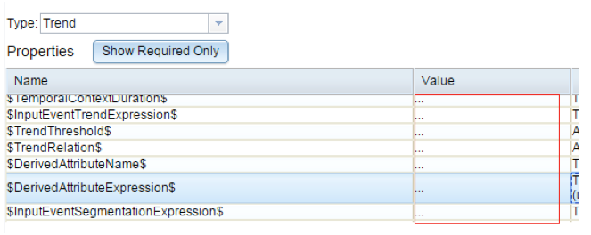
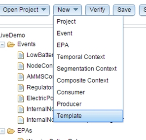
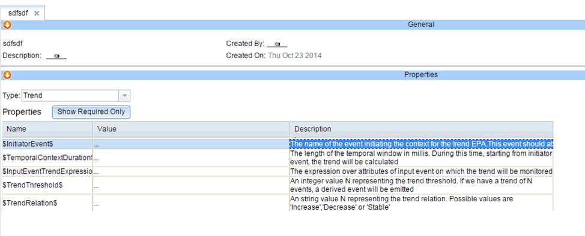
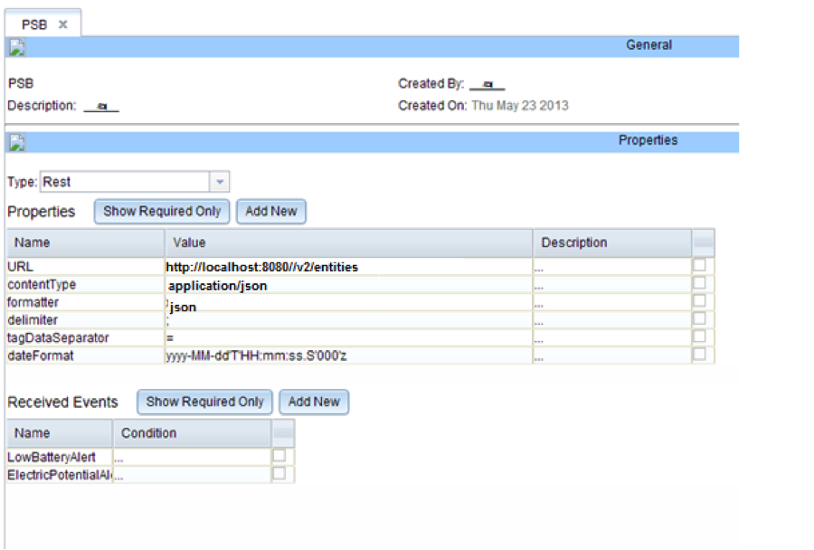

# IBM Proactive Technology Online User Guide
IBM Research – Haifa

Licensed Materials – Property of IBM

©Copyright IBM Corp. 2012, 2013, 2014, 2015, 2016  All Rights Reserved.

Version 5.4.1: July 2016

###Table of Contents

**PART I INTRODUCTION**

[Chapter 1: What is IBM Proactive Technology Online?](#CH1)	 
[Overview](#1overview) 
[Highlights](#highlights) 
[Functional Highlights](#funchighlights) 
[Technical Highlights](#techhighlights)

[Chapter 2: What is a Proton Project?](#CH2) 
[Overview](#2overview) 
[Proton Building Blocks](#blocks) 
[Events](#events) 
[Event Classes](#eventclasses) 
[Producers](#producers) 
[REST API](#api) 
[Consumers](#consumers) 
[Contexts](#contexts) 
[Event Processing Agents](#EPAs) 
[Templates](#templates) 
[EPN](#EPN) 
[Proton Special Fields](#fields) 
[Time Format](#timeformat) 
[Expressions in Proton](#expressions) 
[Recommended Building Process](#buildprocess)

**PART II PROTON DEVELOPMENT WEB USER INTERFACE**

[Chapter 3: Proton Development Web UI](#CH3) 
[Environment and Project Actions](#projactions) 
[Opening a Project](#openproj) 
[Creating a New Project](#createproj) 
[Verifying a Project](#verifyproj) 
[Saving a Project](#saveproj) 
[Exporting a Project](#exportproj) 
[Importing a Project](#importproj) 
[Deleting a Project](#deleteproj) 
[Editing Actions](#editactions) 
[Creating a New Resource](#createres) 
[Opening/Editing an Existing Resource](#openres) 
[Closing a Resource](#closeres) 
[Deleting a Resource](#deleteres)

**APPENDIX**

[Appendix A: Integration with NGSI in the FIWARE project](#appendix) 
[Integration with the Context Broker JSON Format](#integrate) 
- [Getting Events from the Context Broker](#getevents) 
- [Sending Output Events to the Context Broker](#sendevents) 

[Depracated: Integration with the Context Broker XML Format](#integrate_D) 
- [Getting Events from the Context Broker](#getevents_D) 
- [Sending Output Events to the Context Broker](#sendevents_D) 

[Live Demo Design ](#livedemo)

# PART I: INTRODUCTION #
## Chapter 1: What is IBM Proactive Technology Online? ##
### Overview ###
#### Event Detection is Not Enough ####
Many applications are reactive in the sense that they respond to the detection of events. These applications exist in many domains and are useful for many applications (stock market, business opportunities, sales alerts, etc.). Although the event types are known, the exact timing and content of the event instances are usually not known prior to their occurrence. There are many tools in different domains built to detect events, and to couple their detection with appropriate actions. These tools exist in products that implement active database capabilities, event management systems, “publish/subscribe” protocols, real-time systems, and similar products.

Current tools enable applications to respond to a single event. A major problem in many reactive applications is the gap between the events that are supplied by the event source, and the situations that require the business  to react to. To bridge this gap, the business must monitor all the relevant events and apply an ad-hoc decision process to decide whether the conditions for reactions have been met.

#### From Single Events to Pattern Detection ####

IBM Proactive Technology Online, also known as Proton, is a scalable, integrated platform to support the development, deployment, and maintenance of event-driven and complex event processing (CEP) applications. While standard reactive applications are based on reactions to single events, the Proton engine component reacts to situations rather than to single events. A pattern is a condition that is based on a series of events that have occurred within a dynamic time window called a context. Patterns include composite events (e.g., sequence), counting operators on events (e.g., aggregation) and absence operators.

The Proton engine is a runtime tool that receives information on the occurrence of events from event producers, detects patterns, and reports the derived events to external consumers.

Examples of derived events that could be reported:

- The client wishes to receive an alert if at least two of four stocks in a portfolio are up five percent since the beginning of the trading day. 
- The client wishes to activate an automatic “buy or sell” program if, for any stock that belongs to a predefined list of stocks that are traded in two stock markets, there is a difference of more than five percent between the values of the same stock in different stock markets, where the time difference of the reported values is less than five minutes (“arbitrage”).

In other systems, the client side software needs to store and process all the stock quotes from the different markets and decide when to issue the alert (in the first case), or when to operate the “buy or sell” program (in the second case). This may be impossible in some cases, such as for “thin” clients with low storage and processing capabilities. Even if it is possible, a solution that requires a client to process single events may result in a substantial overhead, such as ad-hoc programming efforts, increased communication traffic, or redundant storage. 

The Proton engine enables each client to detect customized patterns without having to be aware of the occurrence of the basic events.

The major domains in which Proton has been successfully integrated include customer relations management, policy management, multi-sensor diagnostic systems, systems management, network management, active services in wireless environments, location-based decision support systems, maintenance management, business process management, monitoring systems, service management, personalized publish/subscribe, and command and control systems.

***Note:** In this manual, we use the semantics and programming model detailed in the book Event Processing in Action by Opher Etzion and Peter Niblett, published by Manning Publications in 2010. For further definitions please refer to this source.* 

###Highlights
####Functional Highlights
Proton's generic application development tool includes the following features:

- Enables fast development of CEP (complex event processing) applications, also known as Event Processing Networks (EPN). 
- Resolves a major problem—the gap that exists between events reported by various channels and the derived events  that require a reaction. These derived events are a composition of events or other derived events (e.g., "when at least 4 events of the same type occur"), or content filtering on events (e.g., "only events that relate to IBM stocks"), or both ("when at least 4 purchases of more than 50,000 shares were performed on IBM stocks in a single week"). 
- Enables an application to detect and react to customized patterns without having to be aware of the occurrence of the basic events.
- Supports various types of contexts (and combinations of them): fixed-time context, event-based context, location-based context, and even detected situation-based context. In addition, more than one context may be available and relevant for a specific event-processing agent evaluation at the same time.
- Offers easy development using web-based user interface, point-and-click editors, list selections, etc. Rules can be written by non-programmer users.
- Receives events from various external sources entailing different types of incoming and reported (outgoing) events.
- Offers a comprehensive event-processing operator set, including joining operators, absence operators, and aggregation operators.
- Includes context-based rules such as “If it is 10 minutes before trade closing time and we have more than 100 transactions to commit” or “If 4 disk failure events have occurred on the same server in the last 20 minutes”.

####Technical Highlights

- A standard Java web application with REST APIs for administration.
- Based on a modular architecture. 

##Chapter 2: What is a Proton Project?
### Overview ###
A Proton project is a set of definitions representing the incoming events and the event-processing agents that implement a certain application.

The Proton engine processes these definitions and takes action whenever needed, reporting anything that is required to the engine consumers.

This chapter explains the different terms used in Proton, from the basic building blocks to the more complex dependent definitions.

### Proton Building Blocks

A Proton project is built from the following definitions: events, producers, consumers, temporal contexts, segmentation contexts, composite contexts, and event processing agents (EPAs). These define an event processing network (EPN) application. 

#### Events ####

Events enter the Proton engine during runtime. They carry information about things that happen in the system domain or in the user's business domain, for example disk failure, too many users, adding a new disk to the server, or user actions such as share purchase order.

An event is an object of an event class, and its attributes are defined based on the event class. Attribute values are always validated in respect to attribute type. The events that are defined in the tool are the event classes. 

#### Event Classes

Event classes describe the different event structures that Proton should recognize. For example, in a stock trading scenario, this could be stockPurchase, stockSell, or tradingDayEnd. 

Events are actual instances of the event classes and have specific values. For example, the event "Today, at 10pm, a customer named John Doe purchased 1000 units of IBM shares at the price of $200 each" is an instance of the "stockPurchase" event class.

##### Built-in Attributes 

Every event instance has a set of built-in attributes in addition to its user-defined attributes. Event built-in attributes include the following:

- **Name** – the name of the relevant event class (such as "stockPurchase"). This attribute must be provided.
- **OccurrenceTime** – an attribute of type Date, which the event source may assign as the event occurrence time. If omitted or left empty, the engine will construct the attribute and set the value to equal the DetectionTime (see below). 
- **DetectionTime** – an attribute of type Date that records the time of event detection by the Proton engine. The time is measured in milliseconds, specifying the time difference between the current machine time at the moment of event detection and midnight, January 1, 1970 UTC. The engine will construct the attribute and set its value.
- **Duration** – an attribute of type Double that represents the time duration of the event in milliseconds in case the event occurs within a time interval. If omitted or left empty, the engine will construct the attribute and set its value to 0.0.
- **Certainty** – an attribute of type Double that represents the certainty of this event. An event certainty can have any value between 0.0 to 1.0. If omitted or left empty, the engine will construct the attribute and set its value to 1.0.
- **Cost** – if omitted or left empty, the engine will construct the attribute and set its value to 0.0.
- **Annotation** – if omitted or left empty, the engine will construct the attribute and set its value to an empty string. 
- **EventId** – a string identification of the event, which can be set by the event source. If omitted or left empty, the engine will construct the attribute and set its value to an auto-generated identifier.
- **EventSource** – holds the name of the source of the event. If omitted or left empty, the engine will construct the attribute and set its value to an empty string.

Only the built-in attribute **Name** must be provided when producing an event to the engine.

The above built-in attributes can be used in an expression in the same manner as user-defined attributes. User-defined attributes should not have the same name as any of the built-in attributes.

#####User-defined Attributes

You can also add your own attributes to the event class, and define their types. If the attribute is an array, you must specify its dimension (array of arrays are supported).
You must provide values to user-defined attributes if used in any expression.

#####Derived Event

An EPA can create one or more derived event instances. These event instances have the same characteristics as an input event. They have both user-defined attributes and built-in attributes, and **need an event definition like any input event**.

####Producers

A producer introduces events from the outside world to the event-processing network. A producer definition includes the following:

- **Type** – the adapter type used by this producer to push or pull events into the EPN. The supported types are File, JMS, REST, and custom adapter. Each adapter type has built-in parameters with the option of adding other parameters. Each parameter has a name and value. The adapter types and their parameters include the following: 
  - **File** – the producer's events are read from a given file. A **file **producer has the following additional built-in parameter:
      - **filename** – full path file name.
  - **Timed** – timed file adapter. The events from the file will not be injected at a constant rate. They will be based on the relative difference of the event’s OccurenceTime attribute value as specified in the event row in the file from start of injection. The first event will always be injected immediately at the start of the adapter. Its occurrence time is considered as time zero. The other events will be injected based on the relative difference between their occurrence time and that of the first event. 
  For example, if the second event’s OccurenceTime (timestamp representation) is 134566788 and the first event’s OccurrenceTime is 134956587, then the first event will be injected at time 0, while the second one will be injected 134956587  134566788  = 389799 millisecs later. 
  The timed adapter has the same properties as the file adapter.    
  - **REST** – This adapter is a REST client that GETs events from an external REST service periodically. A REST type producer has the following additional built-in parameters: 
      - **URL** – the fully qualified URL of the REST service for event pull operation using a GET method.
      - **ContentType** – can be "text/plain", "application/xml", or "application/json". This is defined by the REST service.  
      - **PollingMode** – whether the web service returns a single instance or batch of event instances. 
      **Note:** Proton includes a REST service that provides the ability to push (notify) events to the engine. See [CEP open specification document](http://forge.fiware.org/plugins/mediawiki/wiki/fiware/index.php/FIWARE.OpenSpecification.Data.CEP),
      and a [the detailed CEP API description](http://htmlpreview.github.io/?https://github.com/ishkin/Proton/blob/master/documentation/apiary/CEP-apiary-blueprint.html).
  - **Custom** – The producer's events are read using a custom mechanism defined by the user. In this case, a new type of adapter needs to be added to the adapter framework, as described in the Proton programmer guide.

Additional parameters common to all producer types are:

  - **pollingInterval** – the waiting time between two consecutive accesses to the source to pull events.
  - **sendingDelay** – a delay between sending events into the EPN (mainly for demo purposes). 
  -	**formatter** – the format of the input events (the supported formatters are tag, csv, and json).  
  -	**delimiter** – the delimiter used to separate between different event attributes.
      -	**‘tag’** type formatter – the delimiter defines the separator between key-value pairs. Default is “;”.
      -	**‘csv’** type formatter – the delimiter defines the separator between values. Default is “,”.
  -	**tagDataSeparator** – for a **tag** type formatter, the separator between event attribute name and its value. Default is “=”.
  -	**csvEventType** – for a **CSV** type formatter, the name of the event that is received from the producer.
  -	**csvAttributeNames** – for **CSV** type formatter. Since CSV files only list values, and not keys, of event’s attributes, csvAttributeNames are used as keys. csvAttributeNames is a comma-separated string of the attributes in the order they appear in the CSV file (e.g., Attribute1, Attribute2, Attribute3…). When the CSV file is read, it will link the first value to the first attribute in csvAttributeNames, and so on.
  -	**dateFormatter** - the default date format is dd/MM/YYYY-HH:mm:ss. To use a different format for your input events, specify a date formatter (e.g., dd.MM.yyyy G 'at' HH:mm:ss z).

For custom adapters, additional required parameters can be added. Each such parameter has a name and a value.

####REST API Adapter
As described above for producers, and below for consumers, there is an option for a REST API in Proton.

For the REST API documentation see: [http://htmlpreview.github.io/?https://github.com/ishkin/Proton/blob/master/documentation/apiary/CEP-apiary-blueprint.html](http://htmlpreview.github.io/?https://github.com/ishkin/Proton/blob/master/documentation/apiary/CEP-apiary-blueprint.html)

#### Consumers
A consumer consumes events generated by the EPN and sends them to the outside world. A consumer definition includes the following:

- Type – the adapter type that is used to push or pull events from the EPN. The supported types are File, JMS, REST, and custom adapter. Each adapter type has built-in parameters with the option of adding other parameters. Each parameter has a name and value. The adapter types and their parameters:
      - **File** –the consumer's events are written to a given file. A file consumer has the following additional built-in parameter:
        - **filename** – full path file name.
      - **REST** – a REST client that POSTs events to an external REST service upon detection of derived events. A REST type consumer has the following additional built-in parameters:
        - **URL** – the fully qualified URL of the REST service for event push operation using the POST method.
        - **ContentType** – can be "text/plain", "application/xml", or "application/json". This is defined by the REST service. 
        - **AuthToken** – an optional parameter. When set, it is added as an X-Auth-Token HTTP header of the request. 
      - **Custom** – the consumer's events are written using a custom mechanism defined by the user. In this case, a new type of adapter needs to be added to the adapter framework, as described in the Proton programmer guide.

Additional parameters common to all producer types:

  - **formatter** – the format of the input events (the supported formatters are **tag**, **csv**, and **json**). 
  - **delimiter** – the delimiter used to separate between different event attributes.
  - **‘tag’** type formatter – the delimiter defines the separator between key-value pairs. Default is “;”.
  - **‘csv’** type formatter – the delimiter defines the separator between values. Default is “,”.
  - **tagDataSeparator** – for a **tag** type formatter, the separator between event attribute name and its value. Default is “=”.
  - **csvEventType** – for **CSV** type formatter, the name of the event that is received from the producer.
  - **csvAttributeNames** – for **CSV** type formatter, used as keys since CSV files only list values, and not keys, of event attributes. csvAttributeNames is a comma-separated string of the attributes in the order they appear in the CSV file (e.g., Attribute1, Attribute2, Attribute3…). When the CSV file is read, it will link the first value to the first attribute in csvAttributeNames, and so on.
  - **dateFormatter** - the default date format is dd/MM/YYYY-HH:mm:ss. To use a different format for your output events, specify a date formatter (e.g., dd.MM.yyyy G 'at' HH:mm:ss z).
For custom adapters, additional required parameters can be added. Each such parameter has a name and a value.

#### Contexts

A context determines when a particular event-processing agent is relevant. An event processing agent can have several open context instances at the same time. In such cases, an evaluation is made for each open context in parallel. There are three types of contexts:

#####Temporal context

A temporal context defines a time window in which the event-processing agent is relevant. It starts with an initiator and ends with a terminator.

- **Initiator** – starts the temporal context. The initiator can be an event, system startup, or absolute time. 
- **Terminator** – ends the temporal context. The terminator can be an event, relative expiration time, or an absolute expiration time. A terminator definition is not mandatory; if there is no terminator defined, the lifespan never ends.

Sometimes, more than one temporal context with the same temporal context definition can be open simultaneously. This is possible in the following situations:

- **Sliding windows** – a new temporal window is opened according to the specified sliding period
- **Overlapping windows** – a new temporal window is opened with the arrival of a new initiator event when using the ADD correlation policy (see below)
- **Segmentation contexts** – for each of the context partitions (segmentation value).
- Composite contexts with any of the above.

A temporal context includes the following characteristics:

- Unique name.
- Type. The supported types include:
      - Temporal interval – This is the regular temporal context 
      - Sliding time window – A sliding window has two additional parameters:
        - Sliding period
        - Window duration 
In a sliding time window, a temporal context is created every sliding period, and each such window is active for the window duration time. Those contexts are created as long as the temporal context is active (from its initiation until its termination).
      - Initiator element and terminator element – see details below.

######Temporal Context Initiator

The temporal context initiator can be one of the following: 

- **Startup** – the temporal context is open at the beginning of the run or when the event processing agent is defined.
- **Event initiator** – this event acts as the initiator for this temporal context. 
- **Absolute time** – this specifies the exact time that the temporal context is initiated.

A temporal context may have several different kinds of initiators.

######Event Initiator Features

The event initiator has the following features: 
- It is **not necessarily unique**. A temporal context can have more than one event initiator. When the Proton engine detects an event instance that is a possible initiator, it initiates the temporal context using the first initiator definition that the event satisfies, ordered by appearance in the temporal context definition.
- It may be **conditional**. The condition refers to the initiator event.
- It has a **correlation** policy. The **correlation** policy determines whether to open a new temporal context if another temporal context instance of this event processing agent is already open. The possible correlation values are **Add** and **Ignore**. 

**Add** – initiates a new temporal context, even if another appropriate temporal context is active. 

**Ignore** – does not initiate a new temporal context if another appropriate temporal context is already active. 

######Absolute Time Additional Features

Absolute time is the predefined time when the temporal context should be initiated. The **time** is specified in this format:  ‘dd/MM/yyyy-HH:mm:ss’.

The **correlation** policy determines whether to open a new temporal context if another temporal context of this event  processing agent is already open. The possible correlation values are **Add** and **Ignore**. 

**Add** initiates a new temporal context, even if another temporal context is active. 

**Ignore** does not initiate a new temporal context if another temporal context is already active. This is the default option. 

######Temporal Context Terminator

A terminator can be one of the following types:
- **Event terminator** – the event that acts as terminator for this temporal context.
- **Absolute time** – the exact time at which the temporal context is terminated.
- **Relative time** – the temporal context is terminated after a predefined interval of time that has passed from the initiation of the temporal context to its termination.
- **Never ends** – the temporal context never ends and remains open until the end of the run. 

A temporal context can have more than one terminator. For example, it can have several event terminators, one expiration time, and one expiration interval element. If no terminator is needed, choose the **Never ends** option.

######Event Terminator Features

When the Proton engine detects an event instance that is a possible terminator , it terminates one or more temporal context instances of the same temporal context. The terminators are activated according to their order in the temporal context definition.

Termination may be conditional. The conditions are based on the terminating event. 

The first, last, or every temporal context can be terminated. This is specified by the quantifier parameter.

A temporal context can be terminated or discarded. If the temporal context is terminated, an event-processing agent can still derive events on termination. If the temporal context is discarded, the event instances that have accumulated during this temporal context are discarded, and no detection can occur for this temporal context instance. The terminator behavior is specified in the type parameter.

######Absolute Time Features

The temporal context is terminated or discarded at a predefined time (if it is still open). The **expiration time** is specified in this format: ‘dd/MM/yyyy-HH:mm:ss’. 

There are two possible expiration types: **terminate** and **discard**. These are semantically equivalent to the possible termination types of an **event terminator**.

######Relative Time Features

The temporal context is terminated or discarded after a predefined amount of time passes from its initiation (if it is still open). The expiration interval is specified in milliseconds.

There are two possible expiration types: **terminate** and **discard**. These are semantically equivalent to the possible termination types of an **event terminator**.

#####Segmentation Context

A segmentation context defines a semantic equivalent that groups events that refer to the same entity, according to a set of attributes. 

For example, the **job_id** attribute in the **job_queued** event, and the **job_id** attribute in the **job_canceled** event are semantically equivalent, in the sense that they refer to the same job entity.

A segmentation context value can be either an attribute or an expression based on some attribute values of a certain event. The expression has to be a valid EEP expression.

Each segmentation context has a unique name and a collection of participants events. For each participant event an expression is specified.
 
#####Composite Context

A composite context groups one or more contexts. An event-processing agent with a composite context may have several open context instances in parallel. A composite context instance is open if all the contexts listed in the composite context are matched (conjunction).  If the composite context contains a segmentation context, this segmentation context should be defined over all the event initiators and event terminators of the temporal contexts of this composite context

Each segmentation context has a unique name and a list of contexts.

####Event Processing Agents 

The goal of the Proton engine is to detect predefined patterns according to rules and to generate derived events.

In addition, the engine re-enters the derived events as input events. This feature enables the mechanism of nested patterns.

All EPAs include most of the following general characteristics: 

- Unique name
- EPA type (operator)
- Context
- Other properties such as condition
- Participating events
- Segmentation contexts
- Derived events
Other event-processing features depend on the EPA type.

#####Example

When three login authentication failures occur within 30 minutes, a login error situation is detected, and generates a login alert derived event. If a segmentation context is set to login-id, the derived event is detected only if three failures of the same login ID occur within 30 minutes.

####EPA Properties

#####Operator Type

The operator type defines the pattern above the input events that are required for a pattern detection. The EPAs are divided into the following groups according to type:

**Basic (Filter) operator**  - the pattern is detected if the incoming event passes a threshold condition. The basic is a stateless operator, which does not correlate between its participant events.

**Join operators:**
- All – the pattern is detected if all its listed participant events arrive in any order.
- Sequence – the pattern is detected if all its listed participant events arrive in exactly the order of the operands.

**Absence operator** - none of the listed events have arrived during the context.

**Aggregation operator** –  an Aggregate EPA is a transformation EPA that takes as input a collection of events and computes values by applying functions over the input events. These computed values can be used in the EPA condition and in its derived events.

**Trend operator** – Trend patterns are patterns that trace the value of a specific attribute over time. A Trend EPA detects increment, decrement, or stable patterns among a series of input events. For example, the rise / fall of a stock share price. The Trend operator operates only on a single event type, and detects trends among a minimum specified number of event instances (for example, an increment in the value of five event instances in a row).

Different sets of properties and operands are applicable for each operator.

######Context

A context can be either temporal or composite. It determines the time interval during which particular patterns are relevant (in the above example, 30 minutes from the first login authentication failure). 

If it is a composite context that contains a segmentation context, then either events that fit the segmentation context will be considered as input events for the EPA; or events that are not defined as part of the segmentation context will be considered as input events. 

######Evaluation Policy

The evaluation policy determines when the detected derived event is calculated and reported. The available evaluation policies are **immediate** and **deferred**. 

In the **immediate** mode, a pattern is detected and reported immediately when a new event instance occurs, provided that the conditions of the pattern composition are satisfied. 

In the **deferred** mode, a pattern is detected at the end of the context, provided that the conditions for a pattern composition are satisfied. In this mode, the composition process itself is performed only when the context is terminated. This may yield different results. For example, when defining a pattern that looks for the third event (aggregation with condition on a count variable), and five events  occurred during the context, **immediate** detects and reports the derived event as soon as the third event arrives. However, **deferred** does not detect the pattern, because when the context is finished, five events remain.

In some cases, the evaluation policy is predefined by the operator. It must be **deferred** in the operator's **absence**, since the pattern detection cannot be determined by the arrival of the EPA operands. The operators that use the evaluation policy attribute include: **all**, **sequence**, **aggregation**, and **trend**.

######Cardinality Policy

A pattern can be detected once or multiple times in a context. The **cardinality policy** attribute is set to **unrestricted** if the pattern is calculated any time its conditions are satisfied during a context, no matter how many times. However, it is set to **single** if the pattern should be detected only once during its context. The operators that use the cardinality policy attribute include: **all**, **sequence**, **aggregation**, and **trend**.

######Condition

The **condition property** is the general EPA condition. A derived event is reported only if it fulfills this condition. The **condition** property may refer to the different input events (operands), or the computed variables in case of aggregation EPA.

The **condition **property is applicable for the operators **all**, **sequence**, **aggregate**, and **trend**.

#####Participant Events (Operands)

The participant events are the input events to an EPA. Each participant event has its properties; some of them are the same for all EPA types, and some are relevant to specific types.

The participant events are comprised of the following properties:
- **Event name** – name of the event.
- **Alias** – symbol of the event. The alias helps to distinguish between events when the same event class is  used as two different operands in the same pattern. Event alias is also mandatory in cases where the same event class is used both in the EPA and in its context definition.
- **Condition** – filters the events that participate in the EPA and ignores those that do not satisfy the condition.
- **Consumption** – defines the condition for events to be reused later in the same pattern. This operand is applicable only for **join** operators, **aggregation** operators, and **selection** operators. 

######Operand Properties for Join Operators

**Instance Selection** decides what to do when multiple events of the same operand occur. When the **quantifier** is set to **First**, it selects the first event of the operand that satisfies the pattern conditions. When the quantifier is set to **Last**, it selects the last event of the operand that satisfies the pattern conditions. When the **quantifier** is set to **Override**, only one event is kept for each operand, and a new event replaces the previous event. The difference between **Last** and **Override** is that when using the **Last** selection, all the events are kept, and during the evaluation the **Last** event that matches the pattern condition is used. While when using  **Override** only the last event is available for the pattern evaluation.
 
######Operand Properties for Aggregation Operands 

In an aggregation operator, the user can declare computed variables. These variables are computed during runtime and can be used in the EPA condition and in the expressions assigned to derived event attributes.

Each computed variable has the following parameters:

- **Name** – a unique (within this EPA) variable name. 
- **Aggregation Type** – the type of aggregation to compute, set to one of the following: 
      - **Count** – counts the number of participant events.
      - **Sum** – summarizes the expression value for all the participant events.
      - **Max** – maximum function over the expression value for all the participant events.
      - **Min** – minimum function over the expression value for all the participant events.
      - **Average** – average across the expression value for all the participant events.
- **Expression for every participant event** – The expression value is used to calculate the computed variable according to the aggregation type.

######Operand and EPA Properties for Trend Operands 

In a trend operand, the user declares which attribute value will be measured for the trend, based on the operand attributes.  The user specifies which operand attribute or calculated expression to use for this, in the operand attribute **Expression**.

Furthermore, the user must specify the number of events to satisfy the trend pattern. This is indicated by **Trend Count**. In addition, the user can specify the ratio he seeks for in the trend, indicated by **Trend Ratio**. This number indicates the gradient in the trend and is calculated as the proportion between the last and first participant events. Finally, the user is required to specify the trend direction, under **Trend Relation**. The options for this are **Increase**, **Decrease**, and **Stable**.

#####Segmentation Contexts

An EPA can have segmentation contexts and apply only to events that are semantically related. The EPA participant events are partitioned according to the values of the attributes (or expression) defined by the segmentation context. The detection process is performed separately for each such partition.

If an EPA has a segmentation context, the segmentation context must have a segmentation context segment for every EPA operand. 

An EPA segmentation context defines matching only between the EPA's operands. The EPA general context, which can be composite context that includes segmentation contexts, defines matching between the initiators, terminators, and operands of the EPA.

The operators **basic** and **absence** do not use EPA segmentation contexts, since they do not correlate between operands. 
 
#####Derived Events

When an EPA detects a pattern, it can generate derived events. An EPA can generate more than one derived event. The derived event must be defined as any other event. For each derived event, the following properties must be defined:

- **Event** – the name of the event (one of the already defined events).
- **Condition** – condition for this event derivation. When no condition is specified, the default is to derive the event. 
- For each derived event's attribute, an **expression** defines how to calculate the attribute value. The expression may include attributes of events participating in this pattern. For example: if derived event E2 has attribute A2  we can write an expression whereas A2 content is attribute A1 of the input event E1. For join operators (sequence and all), A2 will be a single value (as each operand is composed of  a single value) while for aggregators and trend operators A2 will be of type array (as the matching set is composed of a set of events). In the latter case, array operations supported by EEP (Expandable Expression Parser) in Proton (see section Expressions in proton) are allowed. In addition, for aggregation operators, the expression may include the computed variables. 

####Templates

To make an easier start-up with a new application, a set of pre-defined event rules has been created. The following common event patterns have a set of pre-defined event rules: FILTER, COUNT, ABSENCE, and TREND, which simplify start-up with a new application. Overwriting these generic templates speeds up the creation of a new application. 

Templates are based on the idea that some scenarios are very common in many domains and could be easily implemented using a common approach. Such scenarios include detecting the absence of an event in a certain time window, filtering (out/in) input events and creating a derived event in case the filter evaluation is true, detecting a trend of some value within a time window, and counting instances of events within a time window. 

Templates are based on Proton’s existing EPN event model. We assume the events figuring in the template have already been defined by the time the template is created, and the template will create all the other relevant artifacts (EPA with policies, temporal, segmentation, and composite contexts).

The steps to be followed: Add a template to the EPN definition project, choose the template type, fill in the  parameter values according to the type, and then export the definitions into JSON. The JSON created will already include all the template artifacts for the pattern. It can be imported back to the authoring tool for additions/changes.

Create a definition using templates as follows:

- Define relevant events and their attributes. For example, if you are using a **Filter** template, the relevant input and derived event of the pattern should already be defined before using a template. 
The assumption is that all the event definitions of the application should already exist prior to using the templates, and the templates only define part of the application. 
Relevant events depend on the template: for the **Filter** template it is just the input and the output event. For other templates, please see the template description.
- In the Authoring Tool click on the New menu and choose the option of creating a new template:  
 
*Figure 1: Authoring Tool – New Menu* 
Specify the name for the template. The created template will be added to the project artifacts tree:
 
*Figure 2: Authoring Tool – Created Template*
- Choose the template type from the drop down box. Fill in the appropriate values in the  template parameters:  
  
*Figure 3: Authoring Tool – Type Selection*

The following values are relevant for the different template types:

- **Filter**: filters out events. It is based on temporal context lasting for the whole lifetime of the application (starting at startup and never ending). Filter creates derived events multiple times, every time the input event passes evaluation.
      - $InputEvent$ - the name of the input event which should be filtered out.
      - $FilterExpression$ - the expression on input events attribute. Only those events for which this expression holds true will cause derivation of output event.
      - $OutputEvent$ - the name of the derived event to create.
      - $DerivedAttributeName$ - the name of the attribute of the derived event in which we want to assign a value. It is usually based on input event attributes.
      - $DerivedAttributeExpression$ - the expression for the derived attribute. Can be a constant value, or based on input event attributes..
- **AbsenceEventInitiator**: detects absence of events in a certain time window, started by some initiator event and lasting for N millis. The absence is detected at the end of time window. The absence is detected for a certain segmentation context. For example, absence of withdrawal following deposit for a certain customer would mean segmentation on customerID.
      - $InputEvent$ - the name of the input event whose absence we are monitoring. 
      - $OutputEvent$ - the name of the event to create if such absence is detected.
      - $InitiatorEvent$ - the name of the event to start the temporal context during which we monitor for absence.
      - $ContextWindowSize$ - defines the length of temporal window during which we monitor the absence, in millis, from initiator event.
      - $DerivedAttributeName$ - the name of the attribute in the derived event, which is derived if absence is detected.
      - $DerivedAttributeExpression$ - the expression for the derived attribute. Can be a constant value, or the partition of the segmentation context.
      - $InputEventSegmentationAttributeExpr$ - the segmentation expression based on the input event attributes for the segmentation context. For example, absence of withdrawal for a certain customer, is the Withdrawal.customerID attribute.
      - $InitiatorEventSegmentationAttributeExpr$- the segmentation expression based on the initiator event attributes for the segmentation context. For example, if the context is initiated by a first deposit of a customer, then the initiator event is the first deposit, and the expression is Deposit.customerID.
- **Count**: counts instances of events in a certain time window, started by some initiator event and lasting for N millis. The count is within a certain segmentation context, for example counting withdrawals for a specific customer (segmentation by customer id). The count is at the end of the time window.
      - $InputEvent$ - the name of the input event we are counting.
      - $OutputEvent$ - The name of the event to emit. 
      - $InitiatorEvent$ - the name of the event to start the temporal context during which we calculate count.
      - $TemporalContextDuration$ - defines the length of temporal window in millis, from initiator event
      - $DerivedAttributeName$ - the name of the attribute in the derived event that will hold the count value.
      - $InputEventSegmentationAttributeExpr$ - the segmentation expression based on the input event attributes for the segmentation context. For example, the number of withdrawals for a certain customer is the Withdrawal.customerID attribute.
      - $InitiatorEventSegmentationAttributeExpr$-the segmentation expression based on the initiator event attributes for the segmentation context. For example, if the context is initiated by a first deposit of a customer, then the initiator event is the first deposit, and the expression is Deposit.customerID.
- **Trend**: searches for a trend of a certain attribute’s value of input event in a certain time window, started by some initiator event and lasting for N millis. The trend is searched for within a certain segmentation context, for example counting withdrawals for a specific customer (segmentation by customer id). The trend is reported the moment the trend count reaches the specified threshold.
      - $InputEvent$ - the name of the input event whose attribute/expression serves as the trend operand. 
      - $OutputEvent$ - the name of the derived event when trend count reaches a certain threshold. 
      - $InitiatorEvent$ - the name of the event to start the temporal context during which we look for trend.
      - $TemporalContextDuration$ - defines the length of temporal window during which we look for trend, in millis, from the initiator event.
      - $InputEventTrendExpression$ - the expression over attributes of the input event over which the trend operator is evaluated. 
      - $TrendTreshold$ - the output event will be derived once the number of trend observations reaches the threshold  specified expression.
      - $TrendRelation$ - specifies the kind of trend we are looking for; ‘**Increase**’, '**Decrease**’ or ‘**Stable**’. 
      - $DerivedAttributeName$ - the name of the attribute in the derived event in which we want to assign value during derivation.
      - $DerivedAttributeExpression$ - the expression for the derived attribute. It can be a trend count (use 'trend.count'), a segmentation partition value, or a constant value.
      - $InputEventSegmentationAttributeExpr$ - the segmentation expression based on the input event attributes for the segmentation context. For example, looking for trend in the withdrawals for a certain customer, is the Withdrawal.customerID attribute.
      - $InitiatorEventSegmentationAttributeExpr$- the segmentation expression based on the initiator event attributes for the segmentation context. For example, if the context is initiated by a first deposit of a customer, then the initiator event is the first deposit, and the expression is Deposit.customerID.

- Verify the correctness of the values you provided by pressing the “**Verify**” button.
- Click **Save and Export** to add the artifacts (EPAs and contexts) defined by the template. This will create the JSON representing the project together with template artifacts. This JSON can be imported back into a project to view the artifacts in the project tree, and to review/change. 
**Note:** Take into account that the template is not a constant project artifact. It is a temporal artifact, therefore it is not saved as part of the project artifacts, If you **Save** or **Save and Export**, the EPA and context artifacts defined by the template will be added to the project, and can be viewed in the tree under **EPAs** and **Contexts** headers. However, the template itself is not saved as part of the project. 
 
*Figure 4: Authoring Tool – Template Menu*  
- Choose the name of the template:  
 
*Figure 5: Authoring Tool – Choose Template Name*  
- Choose the type and fill in the values: 
 
*Figure 6: Authoring Tool – Choose Template Type*   
 
*Figure 7: Authoring Tool – Fill Template Values*  
The template is then placed under artifacts of the project, and the tab can be opened or closed. 
 
*Figure 8: Authoring Tool – Save / Export the Template* 
 
The template is not saved as part of the project. So if you open the project without saving, this information would be lost. 

To generate the artifacts from the template, Save and Export to create the JSON including all the artifacts. 

####EPN
A Proton project is represented by an Event Processing Network (EPN). The EPN is a directed graph, whose nodes are the EPAs and the event classes. The EPN makes it easier to understand the event flow in the project and to understand the hierarchy among the EPAs. 

### Proton Special Fields ###
This section describes specialized fields within an EPN that:
- represent time and describe the supported format 
- define expressions and describe the expression language 

####Time Format

The default format of a date field is the standard  Java time format: ‘dd/MM/yyyy-HH:mm:ss’, where:
- dd – day of the month
- MM – ordinal number of the month
- yyyy – four-digit representation of the year
- HH – hour in a 24-hour format
- mm – minutes
- ss – seconds 

For example, 28/12/2003-18:30:00 means December 28, 2003, 6:30 p.m.

However, if the date comes from the producer  in different formats, a date formatter can be defined as part of the producer parameters. In the same way, a date attribute can be provided to the consumer in a different format by defining a date formatter as part of the consumer properties.

####Expressions in Proton

#####EEP – Expandable Expression Parser

When building an event-processing project, we sometimes need to specify conditions or set values to attributes or properties. We do so by writing expressions.  The EEP—Expandable Expression Parser  tests these expressions at build-time and evaluates them at runtime..

######What is an Expression?

An expression can be a combination of the following:
- **Constant** (5, true, false, "silver", …)
- **Field** (<EventClassName>.<EventAttributeName>)
- **Built-in attribute** (DetectionTime, count, …) and built-in aggregation attributes (sum, max, …)
- **Operator** (+,-,=, …)
- **Context** (context.<segmentationContextName>, context.windowSize)  
- **Built-in function** (arrayContains(a,v), distance(x1,y1,x2,y2), …) 

Examples:

    Max(DayStart.InitialStockLevel,0)
    if CustomerRating="gold" then "approve" else "reject" endif 

#####Operators

<table>
<tr>
<td><b>Type</b></td>
<td><b>Operator</b></td>
<td><b>Example</b></td>
</tr>
<tr>
<td>Mathematical</td>
<td> +    -    /    *</td>
<td> customerBuy.quantity + 5</td>
</tr>
<tr>
<td>Comparison</td>
<td> =   ==   !=   >   <   <=   >= |</td>
<td> customerRating != "gold"</td>
</tr>
<tr>
<td>Boolean</td>
<td>And   or   not   xor &   &&   |   ||   !   ^  true false</td>
<td> customerOrigin = "USA" or customerLanguage = "English"</td>
</tr>
<tr>
<td>If-then-else</td>
<td> if <cond1> then
     Exp1
elseif <cond2> then
     Exp2
else
     exp3
endif</td>
<td> If customerRating = "gold" then
     customerRequest
else
     0
endif</td>
</tr>
<tr>
<td>Lexical</td>
<td>++ (concatenation)</td>
<td> "Name: " ++ Trans.customerName</td>
</tr>
</table>

#####Operands

EEP expressions can include Boolean, Date, Double, Integer, Numeric, or String operand types, or an array of each of these simple types. 

#####Context

- **Segmentation context value** –context.<segmentationContextName> returns the value of a segmentation context. It can be used in an EPA expression.  It cannot  be used in a basic type EPA.
- **Temporal context duration** - context.windowSize returns the time duration of the temporal context in milliseconds. It can be used in an EPA expression. It cannot  be used in a basic type EPA.

#####Built-in Functions

The built-in functions can be grouped in the following categories:

######Mathematical

- **Max** – Max(a,b,c) returns the maximum number among the arguments.
- **Min** – Min(x,100) returns the minimum number among the arguments.
- **Average** – Average(x,y,z,t) returns the average number of the arguments.
- **Modulo** – Mod(x,y) returns the remainder when dividing x by y.
- **Round** – Round(x) returns the closest integer value to x.
- **Absolute** – Abs(x) returns the absolute value of x.
- **Ceil** – Ceil(x) returns the smallest integer value that is not less than x.
- **Floor** – Floor(x) returns the highest integer value that is not greater than x.
- **Crosses** – Crosses(statFunc ,Resolution, …) checks which boundary was crossed by the status function, while considering the resolution of the boundary.

######Structures and Arrays
 
- **ArrayAppend** – ArrayAppend(a,b) appends arrays a and b.
- **ArrayIntersection** – ArrayIntersection(a,b) returns the intersection of the two arrays a and b (common elements).
- **ArraySize** – ArraySize(a) returns the size of the array a (the number of elements).
- **ArrayContains** – ArrayContains(a,v) returns Boolean true if the array a contains the value v; otherwise, returns Boolean false.
- **ArrayGet** – ArrayGet(a,i) returns the value of the i-th element of the array a.
- **ArrayHasGreaterThan** – ArrayHasGreaterThan(a,v) checks whether the array a contains an element with a value greater than v. Returns a Boolean value.
- **ArrayHasLessThan** – ArrayHasLessThan(a,v checks whether the array a contains an element with a value less than v. Returns a Boolean value.
- **ArrayIndexOf** – ArrayIndexOf(a,v) returns the index string of the location of the value v in the array a. For example, if the value is found in location [3][5][6], then the string "3.5.6" is returned; otherwise, "-1" is returned.
- **ArrayInit** – ArrayInit(Data, Type) initializes a new array where the Data string stands for array and the Type string represents the array type.
- **ArrayMaxValue** – ArrayMaxValue(a) returns the maximal value of the elements of the array a.
- **ArrayMinValue** – ArrayMinValue(a) returns the minimal value of the elements of the array a.
- **ArraySum** – ArraySum(a) summarizes the values of the array’s elements.
- **In** – In(v,a) returns Boolean true if the array a contains the value v; otherwise, returns false.
- **SizeOf** – SizeOf(x) returns the size of the element x, that is an instance of a map class.

######Lexical

- **CompareTo** – CompareTo (str1, str2) compares two strings lexicographically. The result is a negative integer if str1 lexicographically precedes str2. The result is a positive integer if str1 lexicographically follows str2. The result is zero if the strings are equal.
- **CompareToIgnoreCase** – CompareToIgnoreCase (str1, str2) compares two strings lexicographically, ignoring case differences. The result is a  negative integer if str1 lexicographically precedes str2. The result is a positive integer if str1 lexicographically follows str2. The result is zero if the strings are equal.
- **CompareToShort** – CompareToShort (str1, str2) compares a “short” string to the prefix of a “long” string lexicographically. Return value equals CompareTo.
- **CompareToShortIgnoreCase** – CompareToShortIgnoreCase (str1, str2).  A combination of CompareToShort() and CompareToIgnoreCase. Compares the prefix of the “long” string with the “short” string lexicographically, ignoring case differences.
- **EndsWith** – EndsWith (str1, str2) tests whether str1 ends with the specified suffix str2. Returns a Boolean value.
- **EqualsIgnoreCase** – EqualsIgnoreCase (str1, str2) compares str1 to  str2, ignoring case considerations. Two strings are considered equal ignoring case if they are of the same length, and the corresponding characters in the two strings are equal ignoring case. Returns a Boolean value.
- **EqualsShort** – EqualsShort (str1, str2) compares a “short” string to the prefix of a “long” string lexicographically, the long string prefix size equals the short string size. Returns a Boolean value.
- **EqualsShortIgnoreCase** – EqualsShortIgnoreCase (str1, str2) a combination of EqualsShort and EqualsIgnoreCase. Compares the prefix of the “long” string with the “short” string lexicographically, ignoring case differences. Returns a Boolean value.
- **FindSubString** – FindSubString (str1, str2) returns the index within str1 of the first occurrence of the specified substring str2. If no such index exists, returns -1.
- **IndexOf** – IndexOf (str1, str2) returns the index within the str1 of the first occurrence of the specified substring str2.
- **IsAlpha** – IsAlpha(str) tests whether the string str does not contain digits. Returns a Boolean value.
- **IsDigit** – IsDigit(str) tests whether the string str contains only digits. Returns a Boolean value.
- **Length** – Length(str) returns the length of string str. The length equals the number of characters in the string.
- **NthToken** – GetNthToken(str,delimiter,index) tokenizes the string str using the delimiter and returns the token in the place index.
- **NumberOfDigits** – NumberOfDigits(str) returns the number of digits within str.
- **Pad** – Pad(str1,str2,num) appends str2 successively until it crosses the length of num, then cuts the last k characters, where k indicates the length of str1. It  then concatenates str1 to it and returns the result.
- **Replace** – Replace(str, target, replacement) replaces the target character in string str with the replacement character and returns the new string.  
- **ReplaceAll** - ReplaceAll(str, regex, replacement) replaces each substring of the string str that matches the given regular expression regex with the given replacement.
- **Split** – Split(str , regex) splits the string str around matches of the given regular expression regex.
- **StartsWith** – StartsWith(str, prefix) tests whether the string str starts with the specified prefix. Returns a Boolean value.
- **StringToBoolean** –StringToBoolean(str) returns the value of the string str as Boolean.
- **StringToDouble** –StringToBoolean(str) returns the value of the string str as Double.
- **StringToInt** – StringToBoolean(str) returns the value of the string str as Int.
- **SubString** – SubString(str, beginIndex, (optional)endIndex) returns a new string, which is a substring of the string str. The substring begins at the specified beginIndex and extends to the character at index endIndex—1 if it exists; otherwise, extends to the end of str.
- **ToLowerCase** – ToLowerCase(str) converts all the characters of the string str to lower case.
- **ToUpperCase** – ToLowerCase(str) converts all the characters in the string str to upper case.

######Geometrical

- **Distance** – Distance(x1,y1,x2,y2) returns the distance between (x1,y1) and (x2,y2).
- **Angle** – Angle(x1,y1,x2,y2) calculates the angle generated between (x1,y1),(0,0),(x2,y2).
- **CenterOfGravity** – Center(x1,y1,x2,y2,x3,y3,...) returns the center of gravity of the listed points (x1,y1), (x2,y2), (x3,y3), etc. Returns an array with the center coordinates as its two elements.
- **InsideCircle** – InsideCircle(x,y,r,cx,cy) returns the Boolean value true if the point (x,y) is inside a circular area defined by the radius r and the center (cx,cy). Otherwise, it returns the Boolean value false.
- **InsideRectangle** – InsideRectangle (x,y,ax,ay,bx,by) returns the Boolean value true if the point (x,y) is inside a rectangular area defined by the upper left corner (ax,ay) and the lower right corner (bx,by). Otherwise, it returns the Boolean value false.

######Calendar

- **TimeDiff** - TimeDiff(date1 ,date2) computes the time difference between two dates. Returns the difference in milliseconds.
- **CompareDates** – CompareDates(date1,date2) compares two dates up to date precision. Returns -1 if date1 precedes date2, returns 1 if date2 precedes date1, and returns 0 if the dates are equal.
- **CompareDay** – CompareDay(date1,day) checks whether day equals the day in date1. If equal, returns 0; otherwise, returns -1.
- **WorkingDays** – WorkingDays(date1,date2) returns the number of working days between the two specified dates.
- **YearsSince** – YearsSince(date1) calculates how many years have passed from the given date1 until the current day.
- **CreateDate** – CreateDate(date1, hours1, minutes1,seconds1) creates a new date with year, month, and day of date1, and hours, minutes, and seconds equal to hours1, minutes1, and seconds1, respectively.
- **GetDate** – GetDate(date1) returns date1 at time 00:00:00 (the date without its time).
- **GetDay** – GetDay(date1) returns the day of the given date1.
- **GetMonth** – GetMonth(date1) returns the moth  of the given date1.
- **GetYear** – GetYear(date1) returns the year of the given date1.
- **GetSeconds** – GetSeconds(date1) returns the number of seconds of the given date1.
- **GetMinutes** – GetMinutes(date1) returns the number of minutes of the given date1.
- **GetHours** - GetHours(date1) returns the number of hours of the given date1.

######General 

- **IsNull** – IsNull(val) checks whether the given val equals null. Returns a Boolean value.
- **ToDouble** – ToDouble(num) converts the given number to double.
- **ToInteger** – ToInteger(num) converts the given number to integer representation.

#####EEP Null Values Handling

When one or more of the operands equals null, EEP adapts the Java language standards. Each of the expression evaluations that is reported as an error in Java causes the EEP to raise an exception, which results in the EPA context closing. For example, when trying to evaluate null + 6, an exception is raised and the relevant EPA context is closed. However, several evaluations can be performed when dealing with a null operand, such as concatenation of a null value operand to a string. Example: “test”++null equals “testnull” (‘++’ stands for concatenation) or a Boolean operator such as true AND null where the result is true.

#####Built-in Attributes

The complete list of built-in attributes can be found in the Event Classes section.

###Recommended Building Process

The main goal of the Proton IDE (Integrated Development Environment) is to help you write correct definitions, through the use of checkboxes, property lists, and point-and-click. For example, to define a temporal context, you select the initiator event and the terminator event from a list of existing events. To define an EPA, you select the operand from a list of existing operands, the context from a list of previously defined contexts, and the segmentation context from previously defined segmentation contexts.

Therefore, we recommend using a bottom-up approach, starting with basic definitions, and then going to higher level definitions. This way, you have all the required building blocks in place when you start to define a new, higher level definition.

We recommend following this definition order. Note that not all definition types are required for all projects.

1.	Event classes 
2.	Segmentation contexts (optional)
3.	Temporal contexts
4.	Composite contexts (optional)
5.	EPAs 
6.	Producers
7.	Consumers

#PART II

#PROTON DEVELOPMENT WEB USER INTERFACE

##Chapter 3: Proton Development Web UI 

###Environment and Project Actions

The Proton user interface is a web-based application . The Proton application is divided into the following parts:

- Buttons for generic actions (at the top).
- Resource navigator area (Explorer) (to the left).
- Editing area (in the center).
- Messages and errors area (at the bottom).
  
 
*Figure 9: Proton Authoring Tool*  

You will generally perform project activities using the buttons at the top, and editing activities using the editing area. 

####Opening a Project

Click **Open Project** and choose an existing project.

####Creating a New Project

To create a new blank project:

1.	Click **New**.
2.	Choose **Project**. 
3.	Enter a project name. 
4.	Click **Add**.

A new project is displayed in the navigator area with the new name and all the required folders.

####Verifying a Project  

To verify an open project, click **Verify**. Project definition errors or warnings are shown in a table in the bottom of the page. Click on an error to open the relevant definition. 

####Saving a Project

To save the definitions of an open project, click **Save**. 

Determine whether you want to save a project that shows errors. The project is saved on the server.  

####Exporting a Project

To export an opened project, click **Save and Export**. You can either save the project locally and download it according to your browser setting, or, assuming the IBM Proactive Technology Online engine is running, you can export the definition to the engine's definition repository. Before a project is exported it is saved on the server.

####Importing a Project

To import a project that is saved in a file in the IBM Proactive Technology Online JSON format, click **Import**.
 
The imported project is saved on the server and displayed in the UI.

####Deleting a Project

To delete an open project, click **Delete**. 

The project is deleted from the server. 

###Editing Actions

####Creating a New Resource 

To create a new resource:

1.	Click **New**.
2.	Select the type of resource you want to create and enter a name for it. 
3.	Click **Add**. 

The editing area displays the new resource, which you can edit. 

Alternatively, replicate an existing resource 

1.	Find the existing resource in the navigator area.
2.	Right click on the resource and choose Replicate.
3.	The editing area displays the new resource. Edit its name in the general section. 

####Opening/Editing an Existing Resource 

To open an existing resource for editing:

1.	Find the resource in the navigator area.
2.	Double-click the resource you would like to edit. The editing area displays the resource data.
3.	Edit the resource attributes and properties. 

####Closing a Resource 

To close the editing area of a resource, click the **X** icon in the editor tab. 

####Deleting a Resource 

To delete a resource:

1.	Find the resource in the navigator area.
2.	Right-click the resource and select **Delete**.

 
#Appendix
 
##Appendix A: Integration with NGSI in the FIWARE project

###Integration with Context Broker JSON Format 

The integration is based on the NGSI/JSON  v1 and v2 (normalized ) format supported by the Context Broker. There are two directions to this integration. The IBM Proactive Technology Online can get input events from the Context Broker, and it can also send output events to the context broker. A specific solution can use both directions or just one of them. 

Although the support of IBM Proactive Technology Online in the NGSI/JSON format was designed as part of the integration with the Context Broker, any other application can use it and communicate with the IBM Proactive Technology Online in this manner. 

####Getting Events from the Context Broker 

An external application should subscribe the IBM Proactive Technology Online to changes in some entities managed by the Context Broker. This subscription should include the REST service URL of the IBM Proactive Technology Online (see the CEP open specification document). Whenever the subscription conditions are met, the Context Broker activates a POST REST of notifyContextRequest, in NGSI JSON format, to the IBM Proactive Technology Online. This REST call is treated as an input event by the IBM Proactive Technology Online. 

Below is an example of such a notifyContextRequest notification sent by the Context Broker:
 
**NGSI JSON v1 format:**

    POST http://cep.lab.fi-ware.eu:8089/ProtonOnWebServer/rest/events
    Content-Type: application/json
    Data:
      {
      "subscriptionId" : "51c04a21d714fb3b37d7d5a7",
      "originator" : "localhost",
      "contextResponses" : [
        {
          "contextElement" : {
            "attributes" : [
              {
                "name" : "temperature",
                "type" : "tempType",
                "value" : 26.5
              },
              {
                "name" : "occupancy",
                "type" : "occType",
                "value" : "low"
              }        ],
            "type" : "Room",
            "isPattern" : "false",
            "id" : "Room1"
          },
          "statusCode" : {
            "code" : "200",
            "reasonPhrase" : "OK"
          }
        }
      ]
    }

**NGSI JSON v2 normalized format:**

    POST http://cep.lab.fi-ware.eu:8089/ProtonOnWebServer/rest/events
    Content-Type: application/json
    Data:
    {
      "subscriptionId": "51c04a21d714fb3b37d7d5a7",
      "data": [
        {
          "id": "Room1",
          "type": "Room",
          "temperature": {
            "value": 26.5,
            "type": "tempType",
            "metadata": {}
          },
          "occupancy": {
            "value": "low",
            "type": "occType",
            "metadata": {}
          }
        }
      ]
    }

The IBM Proactive Technology Online transforms this message to an input event of type: 
 <type>ContextUpdate  (the entity type is concatenated with the string “ContextUpdate”)

In the example above, the entity type is "Room", hence the generated event is of type:
RoomContextUpdate 

In the IBM Proactive Technology Online  application, such an event type must be defined. This event must have all the context attributes defined in the subscription, and two additional mandatory attributes:

- entityId – of type String. This attribute holds the entity id value provided in the message ("Room1" in the examples above)
- entityType – of type String. This attributes holds the entity type provided in the message ("Room" in the example above) 

####Sending Output Events to the Context Broker 

Every output event targeted to be sent to the Context Broker must have the following attributes:
- entityId – of type String
- entityType – of type String.

All the other attributes defined in the event should be attributes defined as context attributes in the corresponding Context Broker entity. 

At runtime, the Context Broker should have a predefined entity with the entityId and entityType listed in IBM Proactive Technology Online event.

The Context Broker entity should also have the IBM Proactive Technology Online built-in attributes (see the [Built-in Attributes list](#eventclasses)).

The IBM Proactive Technology Online application should include a REST type consumer that sends the IBM Proactive Technology Online output events to the Context Broker.

Below is an example of such a consumer:

 
*Figure 10: REST type consumer of JSON payload*

Note that the content type of this consumer is application/json and its formatter is json.

Whenever the IBM Proactive Technology Online detects an event listed in such a consumer definition, the IBM Proactive Technology Online generates a message and sends it via REST PATCH to the Context Broker.

Below is an example for such message data. Note that the entityType and entity id are given as part of the PATCH request URL, while the other event attributes are given as message elements. 
The request URL is built by concatenating the URL specified in the consumer definition with the entity id and type as provided in the output event. For example, for the consumer defined above the URL would be: 

    http://localhost:8080//v2/entities/CEPEventReporter_singleton/attrs?=type=CEPEventReporter

where “CEPEventReporter_singleton” is the entity id and “CEPEventReporter” is the entity type. Those attributes are populated from the event ,and an entity with such id and type should already exist in Context Broker. 
The IBM Proactive Technology Online filters out event attributes with empty values (since this has special meaning in the Context Broker). The IBM Proactive Technology Online does not send the type of the context attributes (this means that if the Context Broker entity has more than one attribute with the same name, all of those attributes are updated). 

Example of output event data generated by the IBM Proactive Technology Online:

    { 
    "EventId" : { 
        "value" : "9e4f7289-b57e-49ca-a980-de634d442f4f" 
      }, 
    "DetectionTime" : { 
        "value" : "1468925471568" 
      }, 
    "Cost" : { 
        "value" : "0.0" 
      }, 
    "Certainty" : { 
        "value" : "0.0" 
      }, 
    "Name" : { 
        "value" : "LowBatteryAlert" 
      }, 
    "temperature" : { 
        "value" : "25.6" 
      } 
    }

###Deprecated: Integration with Deprecated Context Broker XML Format 

*Disclaimer:* While this older XML format has been deprecated officially, it is still supported in this version for safer transition from old versions of both Context Broker and Proton.

The integration is based on the NGSI/XML format supported by the Context Broker. There are two directions to this integration. The IBM Proactive Technology Online can get input events from the Context Broker, and it can also send output events to the context broker. A specific solution can use both directions or just one of them. 

Although the support of IBM Proactive Technology Online in the NGSI/XL format was designed as part of the integration with the Context Broker, any other application can use it and communicate with the IBM Proactive Technology Online in this manner. 

Additionally,  currently it is not possible to add the Fiware-Service and Fiware-ServicePath information to the header of the HTTP request sent to Context Broker by CEP, therefore it is not possible to work with entities in context broker requiring this information.

####Getting Events from the Context Broker 

An external application should subscribe the IBM Proactive Technology Online to changes in some entities managed by the Context Broker. This subscription should include the REST service URL of the IBM Proactive Technology Online (see the CEP open specification document). Whenever the subscription conditions are met, the Context Broker activates a POST REST of notifyContextRequest, in NGSI XML format, to the IBM Proactive Technology Online. This REST call is treated as an input event by the IBM Proactive Technology Online. 

Below is an example of such a notifyContextRequest notification sent by the Context Broker:

    POST [http://cep.lab.fi-ware.eu:8089/ProtonOnWebServer/rest/events](http://cep.lab.fi-ware.eu:8089/ProtonOnWebServer/rest/events)
    Content-Type: application/xml
    Data:
      <notifyContextRequest>
      <subscriptionId>51a60c7a286043f73ce9606c</subscriptionId>
      <originator>localhost</originator>
      <contextResponseList>
      <contextElementResponse>
       <contextElement>
        <entityId type="Node" isPattern="false">
          <id>OUTSMART.NODE_3505</id>
        </entityId>
        <contextAttributeList>
          <contextAttribute>
            <name>TimeInstant</name>
            <type>urn:x-ogc:def:trs:IDAS:1.0:ISO8601</type>
            <contextValue>2013-05-31T18:59:08+0300</contextValue>
          </contextAttribute>
          <contextAttribute>
            <name>presence</name>
            <type>urn:x-ogc:def:phenomenon:IDAS:1.0:presence</type>
            <contextValue></contextValue>
          </contextAttribute>
          <contextAttribute>
            <name>batteryCharge</name>
            <type>urn:x-ogc:def:phenomenon:IDAS:1.0:batteryCharge</type>
            <contextValue>2</contextValue>
          </contextAttribute>
          <contextAttribute>
            <name>illuminance</name>
            <type>urn:x-ogc:def:phenomenon:IDAS:1.0:illuminance</type>
            <contextValue></contextValue>
          </contextAttribute>
          <contextAttribute>
            <name>Latitud</name>
            <type>urn:x-ogc:def:phenomenon:IDAS:1.0:latitude</type>
            <contextValue></contextValue>
          </contextAttribute>
          <contextAttribute>
            <name>Longitud</name>
            <type>urn:x-ogc:def:phenomenon:IDAS:1.0:longitude</type>
            <contextValue></contextValue>
          </contextAttribute>
        </contextAttributeList>
      </contextElement>
      <statusCode>
        <code>200</code>
        <reasonPhrase>OK</reasonPhrase>
      </statusCode>
    </contextElementResponse>
    </contextResponseList>
    </notifyContextRequest>

The IBM Proactive Technology Online transforms this message to an input event of type: 
 <entity type>ContextUpdate  

In the example above, the entity type is "Node", hence the generated event is of type:
NodeContextUpdate 

In the IBM Proactive Technology Online  application, such an event type must be defined. This event must have all the context attributes defined in the subscription, and two additional mandatory attributes:
- entityId – of type String. This attribute holds the entityId value provided in the message ("OUTSMART.NODE_3505" in the example above)
- entityType – of type String. This attributes holds the entity type provided in the message ("Node" in the example above) 

####Sending Output Events to the Context Broker 

Every output event targeted to be sent to the Context Broker must have the following attributes:

- entityId – of type String
- entityType – of type String.

All the other attributes defined in the event should be attributes defined as context attributes in the corresponding Context Broker entity. 

At runtime, the Context Broker should have a predefined entity with the entityId and entityType listed in IBM Proactive Technology Online event.

The Context Broker entity should also have the IBM Proactive Technology Online built-in attributes (see the [Built-in Attributes list](#eventclasses)).

The IBM Proactive Technology Online application should include a REST type consumer that sends the IBM Proactive Technology Online output events to the Context Broker.

Below is an example of such a consumer:

 
*Figure 11: REST type consumer of deprecated XML payload*

Note that the content type of this consumer is application/xml and its formatter is xml.
 
Whenever the IBM Proactive Technology Online detects an event listed in such a consumer definition, the IBM Proactive Technology Online generates an updateContextRequest message and sends it via REST POST to the Context Broker.

Below is an example for such message data. Note that the entityType and entity id are given as part of the context element, while the other event attributes are given as contextAttribute elements. The IBM Proactive Technology Online filters out event attributes with empty values (since this has special meaning in the Context Broker). The IBM Proactive Technology Online does not send the type of the context attributes (this means that if the Context Broker entity has more than one attribute with the same name, all of those attributes are updated). 

Example of output event data generated by the IBM Proactive Technology Online:

    <updateContextRequest>
    <contextElementList>
      <contextElement>
                 <entityId type="CEPEventReporter" isPattern="false">
                        <id>CEPEventReporter_Singleton</id>
                 </entityId>
                <contextAttributeList>
           <contextAttribute>
            <name>EventId</name>
                  <contextValue>4be0ab1c-ec30-4525-b278-78222f3ce081</contextValue>
         </contextAttribute>
           <contextAttribute>
            <name>EventType</name>
                  <contextValue>LowBatteryAlert</contextValue>
         </contextAttribute>
           <contextAttribute>
            <name>DetectionTime</name>
                  <contextValue>2013-06-05T08:25:15.804000CEST</contextValue>
         </contextAttribute>
           <contextAttribute>
            <name>EventSeverity</name>
                  <contextValue>Critical</contextValue>
         </contextAttribute>
           <contextAttribute>
            <name>Cost</name>
                  <contextValue>0.0</contextValue>
         </contextAttribute>
           <contextAttribute>
            <name>Certainty</name>
                  <contextValue>1</contextValue>
         </contextAttribute>
           <contextAttribute>
            <name>Name</name>
                  <contextValue>LowBatteryAlert</contextValue>
         </contextAttribute>
           <contextAttribute>
            <name>OccurrenceTime</name>
                  <contextValue>2013-06-05T08:25:15.804000CEST</contextValue>
         </contextAttribute>
         <contextAttribute>
            <name>TimeInstant</name>
                  <contextValue>2013-06-05T08:24:45.581000CEST</contextValue>
         </contextAttribute>
           <contextAttribute>
            <name>Duration</name>
                  <contextValue>0</contextValue>
         </contextAttribute>
           <contextAttribute>
            <name>AffectedEntityType</name>
                  <contextValue>Node</contextValue>
         </contextAttribute>
           <contextAttribute>
            <name>AffectedEntity</name>
                  <contextValue>OUTSMART.NODE_3505</contextValue>
         </contextAttribute>
        </contextAttributeList>
      </contextElement>
      </contextElementList>
      <updateAction>UPDATE</updateAction>
    </updateContextRequest> 

####Live Demo Design 

The FI-WARE live demo application  demonstrates an application that integrates the IBM Proactive Technology Online and the Context Broker.
 
In the live demo, the IBM Proactive Technology Online is used to detect alerts regarding the status of various entities managed by the Context Broker. Whenever a status of monitored entity is changed, the IBM Proactive Technology Online is notified. The IBM Proactive Technology Online processes those events and generates alerts when some patterns are detected. To manage the alerts generated by the IBM Proactive Technology Online, a singleton entity of entity type CEPEventReporter and entity id CEPEventReporter was defined in the Context Broker. This entity was updated with all the updateContextRequest events generated by the IBM Proactive Technology Online.

This CEPEventReporter entity has the attributes given in the example above. In particular, it has an attribute called EventType that holds the actual alert type detected by the IBM Proactive Technology Online, and an EventSeverity attribute that holds the alert severity. In addition, this singleton entity has the attributes AffectedEntityType and AffectedEntity  to enable identification of the entity that caused the alert.

